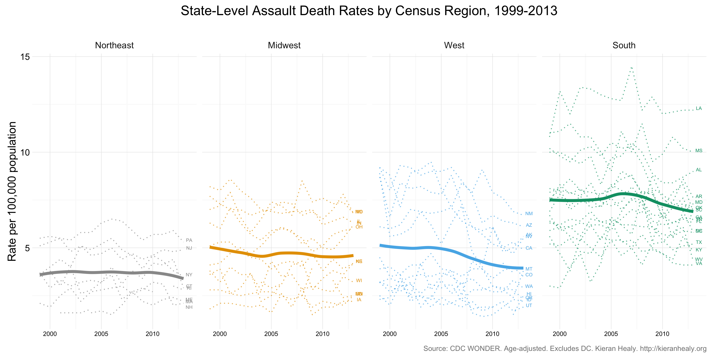

# Endpoint Label example

## Kieran Healy `@kjhealy`

- An example of a little trick to use `geom_text()` together with a single-column data frame to label the endpoints of multiple trend lines in a space-efficient way.

